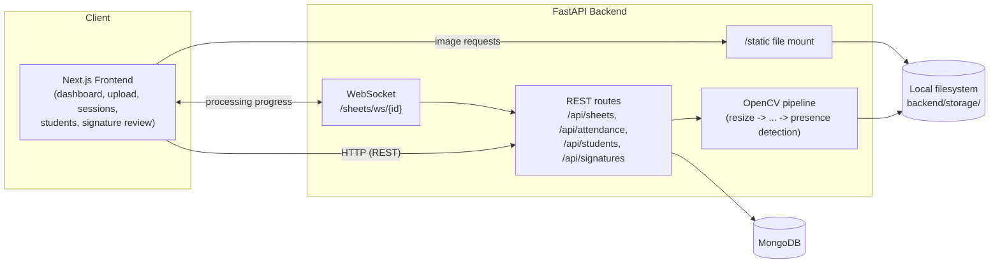

# Student Attendance Management System (SAMS)

An operator console for turning photographed, hand-signed attendance sheets into structured attendance data. A FastAPI backend runs an OpenCV image-processing pipeline against an uploaded sheet photo and a student roster (`info.xml`), detects the sheet's cell grid, crops each student's signature cell, decides presence from ink coverage, and stores the results in MongoDB. A Next.js dashboard lets an operator upload sheets, watch the pipeline run stage-by-stage in real time, browse sessions and students, and review flagged signatures.

## Table of Contents

- [Features](#features)
- [Tech Stack](#tech-stack)
- [Project Architecture](#project-architecture)
- [Project Structure](#project-structure)
- [Prerequisites](#prerequisites)
- [Installation](#installation)
- [Environment Variables](#environment-variables)
- [Running the Project](#running-the-project)
- [Development](#development)
- [API Documentation](#api-documentation)
- [Testing](#testing)
- [Deployment](#deployment)
- [Troubleshooting](#troubleshooting)
- [Contributing](#contributing)
- [License](#license)

## Features

- **Sheet upload** — submit a sheet photo (image) plus a roster (`info.xml`) for a session; the roster is parsed and upserted into the student collection.
- **8-stage OpenCV pipeline** — Resize → Grayscale → Denoise → Deskew → Binarize → Grid Detection → Cell Extraction → Presence Detection, with every intermediate image persisted to disk for auditing.
- **Live processing progress** over a WebSocket (`/sheets/ws/{id}`), including per-stage status and a final `complete`/`failed` event.
- **Attendance results** per session — present/absent, ink ratio, detection confidence, and a cropped signature image per student.
- **Sessions list & detail** with filtering by subject code, date range, and status, plus reprocessing with different pipeline settings.
- **Students list & detail** with per-student attendance history and trend.
- **Attendance summaries and trend** endpoints for dashboard charts (overall trend, per-student aggregate summary).
- **Signature review queue** — flags likely signature mismatches using ORB keypoint matching with a structural (Hu moments/ink density) fallback, comparing each present session's signature crop against the student's previous or earliest reference crop. Operators can confirm or flag each comparison; decisions are persisted and reloaded across sessions.
- **Operator-configurable processing settings** — resize width, adaptive-threshold and deskew parameters, grid-detection thresholds, cell-extraction crop ratios, presence-detection thresholds, and signature-matching thresholds, sent per-request from the Settings page.
- **CLI tooling** (`backend/cli/`) for running the pipeline on a single sheet outside the API (`sams.py`), scoring detections against hand-authored ground truth, visualizing one student's attendance (`infovis.py`), auditing signature similarity (`investigate.py`), and a one-off status migration script (`migrate_status.py`).
- **Mock-data mode** in the frontend (`NEXT_PUBLIC_USE_MOCK`) so every screen can be developed and previewed without a running backend.
- **Dark/light theme toggle** and a backend connection-status indicator.
- **No authentication is implemented today.** The frontend has a placeholder token-storage module (`services/auth.service.ts`) that currently attaches no headers, and the backend exposes no auth routes or middleware.

## Tech Stack

**Frontend**
- Next.js 16 (App Router), React 19, TypeScript
- Tailwind CSS 4
- shadcn/ui components on Radix UI primitives
- TanStack Query (data fetching/caching)
- Recharts (charts)
- Sonner (toast notifications)
- ESLint + Prettier

**Backend**
- FastAPI + Uvicorn (ASGI server)
- Pydantic v2 / pydantic-settings (config and schemas)
- Motor (async MongoDB driver) and PyMongo (used synchronously by the CLI scripts)
- OpenCV (`opencv-python`), NumPy, imutils, Pillow — image processing pipeline
- lxml, xmltodict — roster (`info.xml`) parsing
- pandas, matplotlib — CLI-side data handling and charting (`infovis.py`)

**Database**
- MongoDB (collections: `sessions`, `students`, `attendance`, `signature_reviews`)

**Authentication**
- Not implemented. No login flow, auth routes, or request-level auth checks exist in the backend or frontend.

**APIs**
- REST (FastAPI, JSON) plus one WebSocket endpoint for live pipeline progress
- Auto-generated OpenAPI docs served by FastAPI at `/docs` and `/redoc`

**Testing**
- `pytest` and `httpx` are declared as backend dependencies, but no test modules exist yet (see [Testing](#testing))
- ESLint is configured for the frontend; no frontend test framework is configured

**Deployment / Infrastructure**
- None configured in this repository (no Dockerfile, CI workflow, or deployment scripts were found)

**Other**
- FastAPI `StaticFiles` mount (`/static`) serves uploaded photos and every intermediate pipeline image directly from the backend's local filesystem storage.

## Project Architecture

The frontend and backend are independent applications that communicate over HTTP/WebSocket; there is no shared server-side rendering or direct database access from the frontend.

- The **Next.js frontend** calls the FastAPI backend through a single typed fetch wrapper (`frontend/services/api.ts`), with one `*.service.ts` module per resource (sessions, students, attendance, signatures). It can also run entirely against static mock data (`services/mock-data.ts`) when `NEXT_PUBLIC_USE_MOCK` is not explicitly `false`.
- The **FastAPI backend** exposes REST routes under `settings.API_PREFIX` (`/api` by default) plus a WebSocket at `/sheets/ws/{session_id}`. Route handlers in `app/api/routes/` read/write MongoDB via Motor and delegate CV work to `app/services/`.
- **Processing** (`POST /sheets/{id}/process`) runs as a FastAPI background task, offloading blocking OpenCV work to a thread executor and broadcasting progress events to any WebSocket subscribers for that session as each of the 8 stages completes.
- **Storage**: uploaded photos/rosters and every pipeline step's output image are written to `backend/storage/` (`uploads/` and `steps/`, each under a per-session directory) and served back to the frontend via the `/static` mount.
- **MongoDB** holds session metadata/status, the parsed student roster, per-student attendance records, and operator signature-review decisions.



## Project Structure

```
Student-Attendance-Management-System/
├── backend/
│   ├── app/
│   │   ├── main.py                # FastAPI app: routers, CORS, /static mount, /health
│   │   ├── config.py               # Settings (env-driven), get_settings()
│   │   ├── api/routes/
│   │   │   ├── sheets.py           # upload/process/list sessions, steps, results, evaluation, WS progress
│   │   │   ├── attendance.py       # per-student and aggregate attendance summaries/trend
│   │   │   ├── students.py         # student list/detail
│   │   │   └── signatures.py       # signature review queue, verify, review decisions
│   │   ├── core/
│   │   │   ├── db.py               # Motor/PyMongo clients, index setup
│   │   │   └── storage.py          # StorageManager: upload/step file paths
│   │   ├── models/schemas.py       # Pydantic models (Student, Session, AttendanceRecord, ...)
│   │   └── services/
│   │       ├── pipeline.py         # runs the ordered image-transform steps
│   │       ├── steps/              # ResizeStep, GrayscaleStep, DenoiseStep, DeskewStep, BinarizeStep
│   │       ├── grid_detector.py    # locates the sheet's cell grid
│   │       ├── cell_extractor.py   # crops signature/presence cells from the grid
│   │       ├── presence_detector.py# ink-based present/absent decision
│   │       ├── signature_matcher.py# ORB + structural signature comparison
│   │       ├── info_parser.py      # parses the info.xml roster
│   │       └── evaluation.py       # scores detections against hand-authored ground truth
│   ├── cli/                        # sams.py, infovis.py, investigate.py, migrate_status.py
│   ├── tests/                      # pytest package (currently no test modules)
│   ├── storage/                    # .gitkeep + generated uploads/ and steps/ (gitignored)
│   └── requirements.txt
├── frontend/
│   ├── app/                        # Next.js App Router pages (/, /upload, /sessions, /students, /signatures, /settings)
│   ├── components/
│   │   ├── pages/                  # per-route page components
│   │   └── ui/                     # shadcn/ui primitives
│   ├── services/                   # api.ts (fetch wrapper) + one *.service.ts per resource + mock-data.ts
│   ├── lib/                        # processing-settings.ts, pipeline-stages.ts, signature.ts, utils.ts
│   ├── types/api.ts                # shared API response/request types
│   └── package.json
├── .gitignore
└── README.md
```

## Prerequisites

- **Node.js 20.9+** and npm (required by the installed Next.js version)
- **Python 3.10+** (developed against 3.12; the codebase uses modern type-hint syntax such as `str | None`)
- **MongoDB** instance reachable from the backend (local or remote)

## Installation

Clone the repository, then install each side independently.

```sh
git clone https://github.com/SahanDias/Student-Attendance-Management-System.git
cd Student-Attendance-Management-System
```

**Backend**

```sh
cd backend
python -m venv .venv
# Windows
.venv\Scripts\activate
# macOS/Linux
source .venv/bin/activate

pip install -r requirements.txt
```

**Frontend**

```sh
cd frontend
npm install
```

## Environment Variables

No `.env.example` file is currently committed; create the files below manually before running each app.

**`backend/.env`** (read by `app/config.py` via `pydantic-settings`)

| Variable | Required | Default | Purpose |
|---|---|---|---|
| `MONGODB_URI` | Yes | — | MongoDB connection string used by both the async (API) and sync (CLI) clients. |
| `DB_NAME` | Yes | — | Name of the MongoDB database to use. |
| `STORAGE_ROOT` | No | `storage` | Filesystem root for uploaded sheets/rosters and pipeline step images. Relative paths are resolved from the process's working directory. |
| `API_PREFIX` | No | `/api` | Prefix under which all REST routes are mounted. |

**`frontend/.env.local`** (read via `process.env` in `services/api.ts`)

| Variable | Required | Default | Purpose |
|---|---|---|---|
| `NEXT_PUBLIC_USE_MOCK` | No | mock mode is used unless this is set to exactly `"false"` | Toggles between static mock data and real backend calls. |
| `NEXT_PUBLIC_API_URL` | No | `http://localhost:8000/api` | Base URL the frontend sends REST/WebSocket requests to. |
| `NEXT_PUBLIC_STATIC_URL` | No | `http://127.0.0.1:8000/static` | Base URL used to resolve image paths served by the backend's `/static` mount. |

Never commit real `.env`/`.env.local` files or their values — both are already excluded via `.gitignore`.

## Running the Project

Start the backend first (unless the frontend is running purely in mock mode).

**1. Backend** (from `backend/`, with the virtual environment activated)

```sh
uvicorn app.main:app --reload
```

The API is served at `http://127.0.0.1:8000`, health check at `GET /health`, interactive docs at `/docs`. Run this command from inside `backend/` so the default relative `STORAGE_ROOT` resolves to `backend/storage/`.

**2. Frontend** (from `frontend/`)

```sh
npm run dev
```

The dashboard is served at `http://localhost:3000`. The backend's CORS configuration in `app/main.py` currently only allows the origin `http://localhost:3000`.

If `NEXT_PUBLIC_USE_MOCK` is not set to `"false"`, the frontend runs entirely against mock data and the backend does not need to be running.

## Development

Commands that exist in each package's scripts/config:

**Frontend** (`frontend/package.json`)

| Command | Purpose |
|---|---|
| `npm run dev` | Start the Next.js development server |
| `npm run build` | Production build |
| `npm run start` | Serve the production build |
| `npm run lint` | Run ESLint |
| `npm run format` | Run Prettier (`--write`) |

**Backend**

There is no dedicated dev-server script beyond `uvicorn app.main:app --reload` shown above. Useful CLI entry points under `backend/cli/` (run from `backend/` with the virtual environment active):

| Command | Purpose |
|---|---|
| `python cli/sams.py <image> <info_xml>` | Runs the full pipeline on one sheet synchronously, prints per-stage progress and the resulting present/absent table, and (if `tests/ground_truth.json` has a matching entry) prints accuracy/precision/recall/F1. |
| `python cli/infovis.py <student_index>` | Renders a bar chart and pie chart of one student's attendance history. |
| `python cli/investigate.py <student_index>` | Compares every session's signature crop for a student against their earliest reference and prints similarity scores; exits non-zero if any are flagged. |
| `python cli/migrate_status.py` | One-off migration renaming session status `completed` to `processed`. |

There is no dedicated migrations/seeding tooling — MongoDB indexes are created automatically on API startup via `init_indexes()` in `app/core/db.py`.

## API Documentation

All REST routes below are mounted under the configured `API_PREFIX` (`/api` by default). **No endpoint currently requires authentication.**

### Sheets — `/sheets`

| Method | Route | Purpose | Request | Response |
|---|---|---|---|---|
| POST | `/sheets/upload` | Upload a sheet photo and roster to create a new session | multipart form: `image` (file), `info_xml` (file), `subject_code` (str), `session_date` (str) | `{ session_id, student_count }` |
| POST | `/sheets/{session_id}/process` | Start (or restart) processing for a session as a background task | optional JSON body (`ProcessOptions`): `header_rows`, `signature_col`, plus optional CV-tuning fields for resize/deskew/grid-detection/cell-extraction/presence-detection/signature-matching | `{ session_id, status: "processing" }` |
| GET | `/sheets` | List sessions | query: `subject_code`, `date_from`, `date_to`, `status`, `limit` (default 50), `skip` (default 0) | array of session summaries with detected/present/absent counts |
| GET | `/sheets/{session_id}/steps` | Pipeline step images recorded for a session | — | `[{ name, order, path }]` |
| GET | `/sheets/{session_id}/results` | Attendance detections for a session | — | array of attendance records (student index, present, ink ratio, cell image, confidence) |
| GET | `/sheets/{session_id}/evaluation` | Score detections against hand-authored ground truth | — (404 if no ground-truth entry exists for the session's image filename) | `{ accuracy, precision, recall, f1, per_student: [...] }` |
| WS | `/sheets/ws/{session_id}` | Live processing progress | — | stream of `{ step, order, total, path, status }` events, ending in a `{ status: "complete" | "failed", ... }` event |

### Attendance — `/attendance`

| Method | Route | Purpose | Response |
|---|---|---|---|
| GET | `/attendance/trend` | Attendance rate per processed session, chronological | `[{ date, subject_code, rate }]` |
| GET | `/attendance/summary` | Per-student attendance aggregated across all processed sessions | `[{ index, name, sessions_attended, sessions_total, percentage }]` |
| GET | `/attendance/{student_index}` | Raw attendance records for a student | array of attendance records |
| GET | `/attendance/{student_index}/summary` | Present/absent counts and a per-session series for a student | `{ student_index, present_count, absent_count, total_count, percentage, series }` |

### Students — `/students`

| Method | Route | Purpose | Response |
|---|---|---|---|
| GET | `/students` | List all students | array of `Student` |
| GET | `/students/{index}` | Get one student | `Student` (404 if not found) |

### Signatures — `/signatures`

| Method | Route | Purpose | Response |
|---|---|---|---|
| GET | `/signatures` | Flat review queue: every present session compared against each student's earliest session | array of comparison items with `similarity_score`, `match_method`, `review_required` |
| GET | `/signatures/sessions` | List processed sessions with a count of comparable review items each has | array of session summaries |
| GET | `/signatures/sessions/{session_id}` | Comparison items for one session (each student vs. their previous present session) | array of comparison items |
| GET | `/signatures/reviews` | All previously recorded operator decisions | array of `{ student_index, session_id, decision, note, reviewed_at }` |
| POST | `/signatures/{student_index}/verify` | Re-run comparison for every session a student has, against their earliest reference | `{ student_index, sessions: [...] }` |
| POST | `/signatures/{student_index}/review` | Record an operator's confirm/flag decision (upserted per student+session) | `{ student_index, session_id, decision, note, reviewed_at }` — body: `{ session_id, decision: "confirmed" | "flagged", note? }` |

### Other

| Method | Route | Purpose |
|---|---|---|
| GET | `/health` | Liveness check (outside `API_PREFIX`) |
| GET | `/static/<path>` | Serves uploaded sheets and pipeline/signature crop images directly from `STORAGE_ROOT` |

## Testing

- **Backend**: `pytest` and `httpx` are listed in `requirements.txt`, and `backend/tests/` is set up as a package, but it currently contains no test modules — only an empty `__init__.py`. Running `pytest` from `backend/` will discover zero tests until test files are added.
- **Pipeline accuracy**: `app/services/evaluation.py` can score detections against manually curated ground truth, but this requires creating `backend/tests/ground_truth.json` yourself (keyed by uploaded image filename, e.g. `{ "1.jpeg": { "10000409": true, ... } }`); it is not included in the repository. Once present, run it via `python cli/sams.py <image> <info_xml>` or `GET /sheets/{id}/evaluation`.
- **Frontend**: no automated test framework is configured. `npm run lint` (ESLint) is available.

## Deployment

No Dockerfile, CI/CD workflow, or deployment scripts are present in this repository. Deployment steps depend on the target environment (hosting for the Next.js app, a Python ASGI host for FastAPI, and a reachable MongoDB instance) and are not documented here.

## Troubleshooting

- **CORS errors from the frontend**: `app/main.py` only allows the origin `http://localhost:3000`. If the frontend runs on a different host/port, update `allow_origins` in the backend's CORS middleware.
- **Images fail to load / 404 under `/static`**: `NEXT_PUBLIC_STATIC_URL` must point at the backend's `/static` mount (e.g. `http://127.0.0.1:8000/static`), not the `/api` base — see `staticUrl()` in `frontend/services/api.ts`.
- **Dashboard shows only mock data**: `NEXT_PUBLIC_USE_MOCK` defaults to mock mode unless explicitly set to `"false"` in `frontend/.env.local`.
- **`GET /sheets/{id}/evaluation` returns 404**: there is no ground truth entry for that session's image; create `backend/tests/ground_truth.json` as described in [Testing](#testing).
- **Uploaded files or step images end up in an unexpected location**: `STORAGE_ROOT` is a relative path by default (`storage`), resolved from the process's working directory — run `uvicorn` from inside `backend/`, or set `STORAGE_ROOT` to an absolute path.
- **Backend fails to start / MongoDB connection errors**: verify `MONGODB_URI` and `DB_NAME` in `backend/.env` point at a running, reachable MongoDB instance.

## Contributing

1. Create a feature branch from `main`.
2. Make focused changes; keep backend and frontend changes in separate commits where practical.
3. Run `npm run lint` (frontend) and, once a test suite exists, `pytest` (backend) before opening a pull request.
4. Open a pull request describing the change and the reasoning behind it.

## License

No license file is present in this repository. The license has not been specified.
